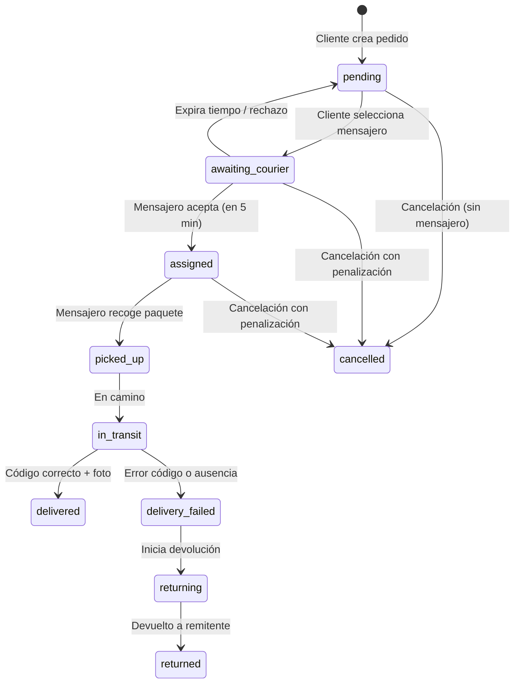

# Flujos de negocio

**Última actualización:** 2026-05-22

## 1. Verificación de mensajero

1. Usuario se registra con rol `courier`. Sus metadatos (`full_name`, `role`, `id_card_number`, `vehicle_type`) son insertados en `profiles` automáticamente por el trigger `on_auth_user_created`.
2. Desde la pantalla de perfil, el mensajero puede subir fotos del carnet (anverso y reverso) mediante la cámara. Las imágenes se almacenan en el bucket `id_docs`.
3. Su `verification_status` es `pending`. No puede activarse.
4. Un admin (rol `admin`) revisa los documentos desde el panel de administración.
   - Si aprueba, cambia a `approved`, fija `verified_by` y `verified_at`.
   - Si rechaza, `rejected`.
5. Con `approved`, el mensajero puede poner `is_active = true` (selector en su perfil) y su `availability_status` pasa a `available`.

## 2. Ciclo de vida de un pedido

**Estados y transiciones:**

| Estado | Significado | Disparador |
|--------|-------------|------------|
| `pending` | Creado, esperando selección de mensajero | Creación |
| `awaiting_courier` | Mensajero elegido, espera aceptación (5 min) | `select-courier` |
| `assigned` | Mensajero aceptó | `accept-order` |
| `picked_up` | Paquete recogido, código generado | `confirm-pickup` |
| `in_transit` | En camino | automático tras recogida |
| `delivered` | Entregado exitosamente | `confirm-delivery` (código OK) |
| `delivery_failed` | Falló entrega | `confirm-delivery` (código erróneo) |
| `returning` | Devolución en curso | `initiate-return` |
| `returned` | Devuelto al remitente | `complete-return` |
| `cancelled` | Cancelado | `cancel-order` |

## 3. Flujo en la aplicación móvil

1. **Cliente** crea el pedido desde la pestaña "Pedidos" (botón "+").
   - Se obtiene la ubicación GPS para el punto de recogida (marcador rojo arrastrable).
   - Toca en el mapa para fijar el punto de entrega (marcador azul).
   - Introduce el email del destinatario (debe ser un usuario registrado en RUNpii; se verifica con `get_user_id_by_email`).
   - Selecciona tamaño del paquete, peso, si es frágil y añade instrucciones.
   - Al confirmar, se crea el pedido en estado `pending` y se guardan las coordenadas como tipo `geography`.

2. El cliente es redirigido a la pantalla de **Selección de mensajero**.
   - Se consulta `nearby_couriers` con la ubicación de recogida.
   - El mapa muestra:
     - Marcador rojo: recogida.
     - Marcador azul: entrega.
     - Marcadores verdes: mensajeros disponibles con su ubicación en tiempo real.
     - Línea amarilla: ruta del pedido.
   - En la lista inferior, cada tarjeta muestra:
     - Nombre, vehículo, valoración.
     - Capacidad de carga.
     - Precio estimado = `distancia_total_del_pedido * price_per_km`.
   - Al tocar un mensajero, se abre un modal con los detalles completos y el precio desglosado.
   - Al confirmar, se invoca `select-courier` y el pedido pasa a `awaiting_courier`.

3. **Mensajero** recibe una notificación push y puede ver el pedido en su lista de "Pedidos".
   - Entra al detalle del pedido y ve las ubicaciones en el mapa.
   - Tiene 5 minutos para aceptar o rechazar (botones "Aceptar pedido" / "Rechazar").
   - Si acepta, `availability_status` se mantiene en `available` para que pueda seguir recibiendo más pedidos.
   - Si rechaza o expira, el pedido vuelve a `pending`.

4. Una vez asignado (`assigned`), el mensajero puede **confirmar la recogida**.
   - Al tocar "Confirmar recogida", el estado cambia a `picked_up` y se genera un código de verificación de 6 dígitos (trigger).
   - El destinatario y el cliente reciben una notificación push y pueden ver el código en la pantalla de detalle del pedido (formateado como `123 456`).

5. El mensajero procede a la **entrega**.
   - Toca "Entregar", toma una foto del comprobante (cámara o galería) y luego introduce el código de verificación que le dicta el destinatario.
   - Si el código es correcto: `delivered`, se guarda la foto en `delivery-photos`.
   - Si el código es incorrecto: se incrementa `verification_attempts`. Al tercer fallo, `delivery_failed`.

6. Si la entrega falla, el mensajero puede **iniciar la devolución** (`initiate-return`). Se crea un registro en `returns` y el pedido pasa a `returning`.
   - Al devolver el paquete al remitente, el mensajero toca "Finalizar devolución" (`complete-return`) y el pedido queda `returned`.

7. En cualquier momento antes de la recogida, el cliente puede **cancelar el pedido** (`cancel-order`), con posible penalización si el mensajero ya estaba implicado.

## 4. Seguimiento en tiempo real

- La pantalla de detalle del pedido se suscribe a cambios en la tabla `orders` mediante Supabase Realtime (`postgres_changes`).
- Los participantes ven el estado actualizado instantáneamente, los botones de acción según su rol, el código de verificación (cuando procede) y la foto de comprobante de entrega.
- La lista de pedidos y la lista de chats activos también se actualizan en tiempo real con filtros por usuario.

## 5. Chat interno

- Habilitado desde el momento en que el pedido es `assigned` hasta que finaliza.
- Participan remitente, mensajero y destinatario.
- La tabla `messages` almacena texto e imágenes (comprimidas a 1024 px y calidad 0.7).
- Las imágenes se almacenan en el bucket `chat_attachments`.
- El chat usa Realtime de Supabase para mensajes instantáneos.
- Los mensajes muestran el nombre del remitente (de `public_profiles`), cacheado localmente para evitar consultas repetitivas.
- Existe una pestaña dedicada "Chats" que lista todos los chats activos del usuario.

## 6. Sistema de reputación

- Al terminar un pedido (`delivered` o `returned`), los participantes pueden valorarse.
- Se eligen 1-5 estrellas, etiquetas (Puntual, Cuidadoso, Amable, Rápido, Buena comunicación) y un comentario opcional.
- El trigger `on_rating_created` actualiza automáticamente la reputación en `profiles`.
- La constraint UNIQUE `(order_id, from_user_id)` impide doble valoración.
- Antes de mostrar la pantalla de valoración, se verifica que el usuario a valorar es realmente participante del pedido.

## 7. Política de cancelación

- **Sin mensajero** (`pending`): sin costo.
- **Con mensajero implicado** (`awaiting_courier`, `assigned`): se cobra al remitente el 50 % del `estimated_price` (cuando Stripe esté integrado).
- **Cancelación por mensajero**: se penaliza con etiqueta negativa automática y el pedido vuelve a `pending` (remitente elige otro).
- **Expiración de aceptación**: sin penalización; el pedido se libera.

## 8. Devolución (logística inversa)

- Si el pedido llega a `delivery_failed`, se crea un registro en `returns` con estado `initiated`.
- Se notifica al remitente.
- Se asigna o selecciona un mensajero para la ruta inversa. El pedido original pasa a `returning`.
- Al entregar al remitente, `return_status` = `completed` y pedido original `returned`.

## 9. Historial de pedidos

- La pantalla de pedidos tiene un toggle "Activos" / "Historial".
- Activos: pedidos en estados no finales (`pending`, `awaiting_courier`, `assigned`, `picked_up`, `in_transit`, `delivery_failed`, `returning`).
- Historial: pedidos en estados finales (`delivered`, `cancelled`, `returned`).

## 10. Protección de documentos verificados

- Una vez que el estado `verification_status` es `approved`, el trigger `prevent_verified_document_changes` bloquea cualquier modificación a `id_card_number`, `id_card_front_url` e `id_card_back_url`.
- El frontend deshabilita los campos y muestra un mensaje informativo.
- Solo un administrador puede revertir el estado para permitir cambios.

## 11. Recuperación de contraseña

- El usuario solicita un enlace de reseteo desde la pantalla "Olvidé mi contraseña".
- Supabase Auth envía un email con un enlace que abre la app mediante deep link.
- La app detecta el token y navega a la pantalla "Nueva contraseña".
- El usuario establece una nueva contraseña y se redirige al login.

## 12. Compresión de imágenes

Antes de subir a Supabase Storage, se usa `expo-image-manipulator` con los siguientes parámetros:

| Uso | Ancho máximo | Calidad | Formato |
|-----|-------------|---------|---------|
| Avatar | 512 px | 0.7 | JPEG |
| Documentos | 2048 px | 0.8 | JPEG |
| Chat | 1024 px | 0.7 | JPEG |
| Entrega | 1280 px | 0.75 | JPEG |

## 13. Presencia de mensajeros (heartbeat)

- La columna `last_seen` en `profiles` registra la última vez que el mensajero dio señales de vida.
- El frontend actualiza `last_seen` cada 60 segundos mientras el mensajero está activo y no está en `offline` o `busy`.
- La función `nearby_couriers` excluye a los mensajeros cuyo `last_seen` sea anterior a 30 minutos.
- La conectividad del dispositivo se monitorea con `NetInfo`. Al perder la conexión, el mensajero pasa automáticamente a `offline`. Al recuperarla, se restaura su estado anterior (`available` o `busy`).

## 14. Accesibilidad (a11y)

- Los botones principales incluyen propiedades `accessibilityLabel`, `accessibilityRole` y `accessibilityHint`.
- El código de verificación se muestra con separador central (`123 456`) para mejorar la legibilidad.
